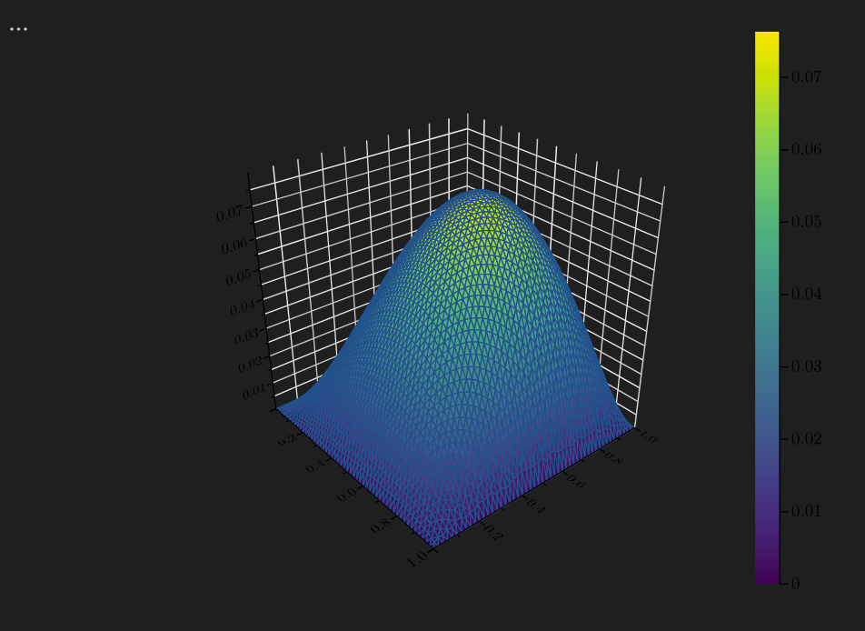

# Finite Element Modeling of Vibrating Elastic Structures

Welcome to the Finite Elements Course Repository!

This repository contains materials and resources related to the Finite Elements course taught by Professor Domenico Layahe from TU Delft.

## Course Overview
- **Professor:** Domenico Layahe
- **University:** Technical University of Delft
- **Topic:** FEM for vibrating structures

## Course Description
The Finite Elements course delves into the fundamental principles and applications of the Finite Elements Method. Led by Professor Domenico Layahe, this course has covered the mathematical derivation of the weak form, the design of a 2-dimensional mesh and the development of algorithms to solve linear systems and differential equations. In particular, we have used the Julia programming language as a tool to carry out most computations. 

## Contents
This repository contains:
- LaTeX notes on the derivation of the weak form for Poisson and Euler-Bernoulli equation
- Julia code that implement and solve the problems mentioned above
- Other supplementary scripts in other languages

-  (Example: 2D Poisson Equation)

## How to Use
Feel free to explore the contents of this repository:
- Clone this repository to your local machine using `git clone`.
- Refer to the lecture notes and code examples to understand the concepts taught in the course.
- Experiment with the Julia scripts provided to simulate and analyze the behavior of the Euler-Bernoulli beam equation.

## Contributors
- Professor Domenico Layahe (Course Instructor)
- Students enrolled in the course

## Acknowledgments
We express our gratitude to Professor Domenico Layahe for imparting valuable knowledge and insights throughout the course.

## Contact
For any inquiries or suggestions regarding this repository, please contact:
- Professor Domenico Layahe: [domenico.layahe@delftuniversity.edu](mailto:domenico.layahe@delftuniversity.edu)
- Course contributors: [Contributors](link_to_contributors)

We hope you find the materials in this repository helpful in understanding the Finite Elements Method and studying the behavior of the Euler-Bernoulli beam equation using Julia.

Happy learning!
